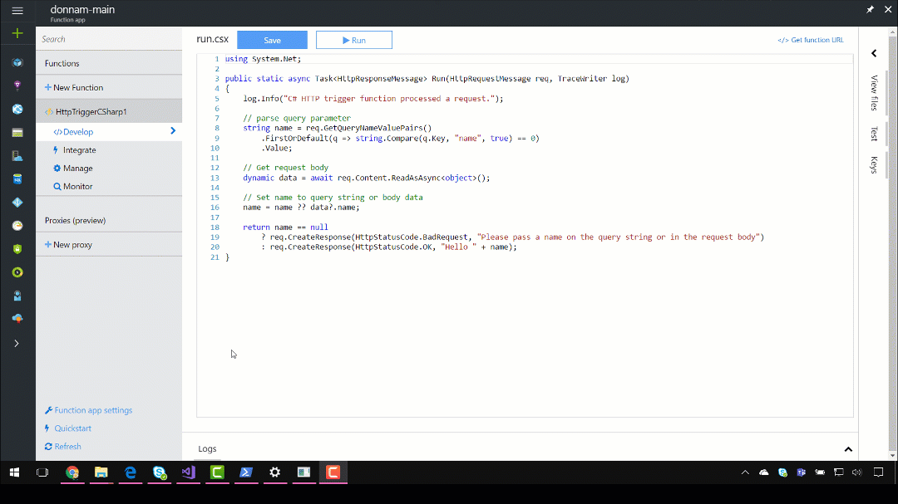

If you have an existing Function App with C# functions, follow these steps to convert it from script files to a Visual Studio project. 

## Prerequisites
- Visual Studio 2015 Update 3 with [Azure SDK 2.9.6](https://go.microsoft.com/fwlink/?LinkId=518003&clcid=0x409)
- [Visual Studio Tools for Azure Functions](https://aka.ms/azfunctiontools)
- [Azure Functions CLI](https://npmjs.com/package/azure-functions-cli)

## Download existing code and settings

1. Go to the Kudu site for your Function App (**Function App Settings** -> **Go to Kudu**)

2. Navigate to the `site` folder. Click the download link. Alternatively, navigate to `https://function-app-name.scm.azurewebsites.net/api/zip/site/wwwroot/`. Save the file `wwwroot.zip` to a temporary directory on your computer.

3. In Visual Studio, create a new Azure Functions project via **Visual C#** -> **Cloud** -> **Azure Functions (Preview)**. Uncheck **Create directory for solution**, as this can interfere with the folder structure when using Continuous Integration and Deployment.

4. Unzip `wwwroot.zip` and copy the contents to the project you created in Visual Studio. Verify that your functions appear in Solution Explorer.

5. From a command prompt, do the following:

   - `func azure login`
   - (optional) `func azure account list` to list subscriptions and `func azure account set <SubscriptionId>`
   - `func azure functionapp list`
   - `func azure functionapp fetch-app-settings <functionappname>`

