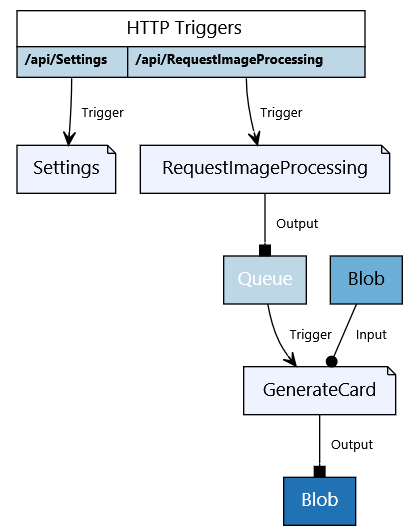

# CoderCards - trading card generator

CoderCards is a geek trading card generator. It uses Microsoft Cognitive Services to detect the predominant emotion in a face, which is used to choose a card back.

The sample demonstrates the following features
- C# attributes and Visual Studio 2017 tooling
- Functions backing a SPA, hosted in Azure Storage
- Azure Functions proxies to customize the site index.html

There's also a C# script version of this sample: [CoderCards](https://github.com/lindydonna/codercards).

[](https://portal.azure.com/#create/Microsoft.Template/uri/https%3A%2F%2Fraw.githubusercontent.com%2FAzure-Samples%2Ffunctions-dotnet-codercards%2Fmaster%2FAzureDeploy%2Fazuredeploy.json)

## Prerequisites

* To build the functions project, use [Visual Studio 15.3 Preview](https://www.visualstudio.com/vs/preview/) and the [Azure Functions Tooling VSIX](https://marketplace.visualstudio.com/items?itemName=AndrewBHall-MSFT.AzureFunctionToolsforVisualStudio2017).

* To run the setup script, install the [Azure CLI](https://docs.microsoft.com/en-us/cli/azure/install-azure-cli). 

## About the sample

* There are two functions defined in this project:
  * **RequestImageProcessing**. HTTP trigger that writes a queue message. The request payload must be in the following form:

  ```json
      {
        "PersonName": "Scott Guthrie",
        "Title": "Red Polo Connoisseur",
        "BlobName": "Scott Guthrie-Red Polo Connoisseur.jpg"
      }
  ```

  * **GenerateCard**. Queue trigger that binds to the blob specified in the BlobName property of the queue payload. Based on the predominant emotion of the input image, it generates a card using one of 4 card templates.
     
     * The card is written to the output blob container specified by the app setting `output-container`. 

Here's a visualization of the bindings, using the [Azure Functions Bindings Visualizer](https://functions-visualizer.azurewebsites.net):



## Setup

### Setup script

Use the Python setup script [setup.py](setup.py). This uses the Azure CLI 2.0 to automate the storage account setup. Run the following commands:

```
az login
python setup.py storage-account resource-group true
```

This will modify the file [local.settings.json](CoderCards/local.settings.json). The last argument controls whether to create containers prefixed with "local".

Alternatively, you can run the script from the Azure Cloud Shell in the Azure Portal. Just run `python` and paste the script. The script prints out settings values that you can use to manually modify `local.settings.json`. 

### Required App Settings 

| Key                 | Description |
|-----                | ------|
| AzureWebJobsStorage | Storage account connection string |
| EmotionAPIKey       | Key for [Cognitive Services Emotion API](https://www.microsoft.com/cognitive-services/en-us/emotion-api) |
| input-queue         |  Name of Storage queue for to trigger card generation. Use a value like "local-queue" locally and "input-queue" on Azure
| input-container     | Name of Storage container for input images. Use a value like "local-card-input" locally and "card-input" on Azure |
| output-container     | Name of Storage container for output images. Use a value like "local-card-output" locally and "card-output" on Azure |
| SITEURL              | Set to `http://localhost:7071` locally. Not required on Azure. |
| STORAGE_URL          | URL of storage account, in the form `https://accountname.blob.core.windows.net/` |
| CONTAINER_SAS        | SAS token for uploading to input-container. Include the "?" prefix. |

If you want to set these values in Azure, you can set them in *local.settings.json* and use the Azure Functions Core Tools to publish to Azure.

```
python setup.py storage-account resource-group false
func azure functionapp publish function-app-name --publish-app-settings
```

## Local debugging in Visual Studio 

- If you're using Visual Studio 2017 Update 3 and the Azure Functions Tools VSIX, open the project [CoderCards.csproj](CoderCards/CoderCards.csproj). F5 will automatically launch the Azure Functions Core tools.

- The project has a custom launchSettings.json that passes these arguments to the Functions Core Tools: `host start --cors * --pause-on-error`.

## Running the demo

### Running using the provided SPA webpage

Make sure the functions host is running locally via Visual Studio or the Azure Functions Core Tools.

In a command prompt, go to the `CoderCardsClient` directory.

- Run `npm install`
- Run `npm start`. This will launch a webpage at `http://127.0.0.1:8080/`. Navigate instead to `http://localhost:8080`.

### Running manually 
1. Choose images that are **square** and upload to the `card-input` container. (Images that aren't square will be stretched.)
2. Send an HTTP request using Postman or CURL, specifying the path of the blob you just uploaded:

    ```json
    {
      "PersonName": "My Name", 
      "Title": "My Title",
      "BlobName": "BlobFilename.jpg"
    }
    ```

## Notes

* The demo uses System.Drawing, which is NOT recommended for production apps. To learn more, see [5 Reasons You Should Stop Using System\.Drawing from ASP\.NET](http://photosauce.net/blog/post/5-reasons-you-should-stop-using-systemdrawing-from-aspnet).

* Happy faces get a multiplier of 4, angry gets a multiplier of 2. I encourage you to tweak for maximum comedic effect!

## Talking points about Azure Functions

* Creating an HTTP trigger that writes a queue message is just one line of code!

* Using a queue message to trigger blob processing is preferable to a blob trigger, as it is easier to ensure transactional processing. Blob triggers can be [delayed for up to 10 minutes on the Consumption plan](https://docs.microsoft.com/en-us/azure/azure-functions/functions-scale#how-the-consumption-plan-works)

* By binding to a POCO, you can use the payload of a trigger to configure an input binding. In this example, we binding to the `BlobName` property in the queue message.

* The input binding is just a byte array, which makes it easy to manipulate with memory streams (no need to create new ones). Other binding types for C# are Stream, CloudBlockBlob, etc, which is very flexible. The output binding is just a stream that you just write to.

## Next steps

For more information about the Azure Functions Visual Studio tooling, see the following:

- [Visual Studio 2017 Tools for Azure Functions](https://docs.microsoft.com/en-us/azure/azure-functions/functions-develop-vs)
- [Using \.NET class libraries with Azure Functions](https://docs.microsoft.com/en-us/azure/azure-functions/functions-dotnet-class-library)
- [Code and test Azure functions locally](https://docs.microsoft.com/en-us/azure/azure-functions/functions-run-local)
- Video: [Azure Functions Visual Studio Tooling](https://www.youtube.com/watch?v=BN2sIRrOt8A)
- Video: [Cloud Cover: Azure Functions Local Debugging and More with Donna Malayeri](https://channel9.msdn.com/Shows/Cloud+Cover/Episode-231-Azure-Functions-Local-Debugging-and-More-with-Donna-Malayeri)
